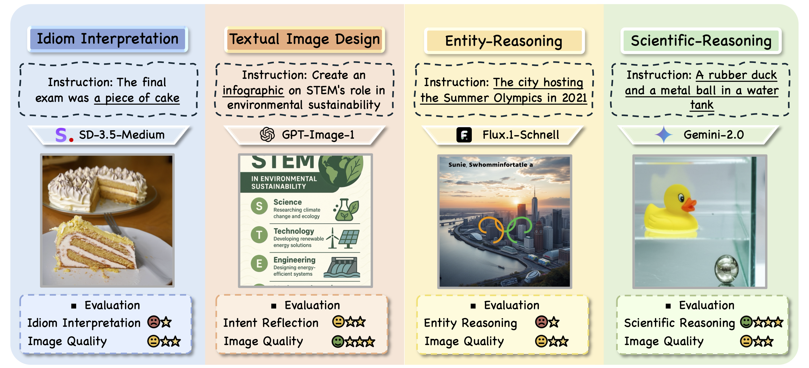
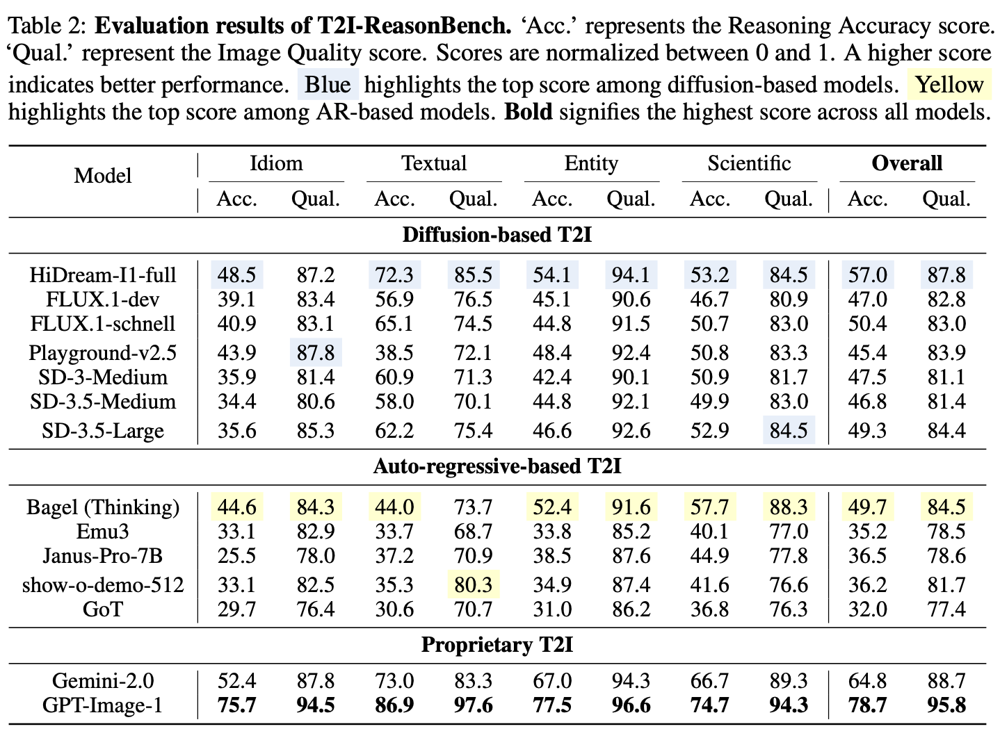

# T2I-ReasonBench: Benchmarking Reasoning-Informed Text-to-Image Generation

<a href='https://arxiv.org/abs/----'></a> 


This repository is the official implementation of the following paper:
> **T2I-ReasonBench: Benchmarking Reasoning-Informed Text-to-Image Generation**<br>
> [Kaiyue Sun](https://scholar.google.com/citations?user=mieuBzUAAAAJ&hl=en)<sup>1</sup>, [Rongyao Fang](https://rongyaofang.github.io/)<sup>2</sup>, [Chengqi Duan](https://scholar.google.com/citations?user=r9qb4ZwAAAAJ&hl=en)<sup>1</sup>, [Xian Liu](https://alvinliu0.github.io/)<sup>2</sup>, [Xihui Liu](https://xh-liu.github.io/)<sup>1</sup><br>
> ***<sup>1</sup>The University of Hong Kong, <sup>2</sup>The Chinese University of Hong Kong***<br>

### Table of Contents
- [Updates](#updates)
- [Overview](#overview)
- [Evaluation Results](#evaluation_results)
- [Prompt Suite](#prompt_suite)
- [Installation](#installation)
- [Prepare Evaluation Videos](#prepare_images)
- [MLLM-based Evaluation](#mllm_eval)
- [Citation](#citation)

<a name="updates"></a>
## 🚩 Updates
- :black_square_button: [TODO] Release the human evaluation scores.
- :black_square_button: [TODO] Release the generated images.
- ✅ [08/2025] Release the scripts for generating the pipeline prompts.
- ✅ [08/2025] Release the scripts for generating evaluation question-criterion pairs.
- ✅ [08/2025] Release the prompt dataset and evaluation scripts for the 4 dimensions.
  
<a name="overview"></a>
## :mega: Overview

We introduce T2I-ReasonBench, a novel benchmark designed to explore the reasoning border of T2I models.
T2I-ReasonBench comprises 800 meticulously designed prompts organized into four dimensions: **(1) Idiom Interpretation**, **(2) Textual Image Design**, **(3) Entity-Reasoning**, and **(4) Scientific-Reasoning**. These dimensions challenge models to infer latent meaning, integrate domain knowledge, and resolve contextual ambiguities. To quantify the performance, we introduce a two-stage evaluation framework: a large language model (LLM) generates prompt-specific question-criterion pairs that evaluate if the image includes the essential elements resulting from correct reasoning; a multimodal LLM (MLLM) then scores the generated image against these criteria. 
Experiments across 14 state-of-the-art T2I models reveal that open-source models exhibit critical limitations in reasoning-informed generation, while proprietary models like GPT-Image-1 demonstrate stronger reasoning and knowledge integration. Our findings underscore the necessity to improve reasoning capabilities in next-generation T2I systems. This work provides a foundational benchmark and evaluation protocol to guide future research towards reasoning-informed T2I synthesis. 

<a name="evaluation_results"></a>
## :mortar_board: Evaluation Results
We benchmark 12 publicly available text-to-image generation models and 2 proprietary models including GPT-Image-1 and Gemini-2.0. 



<a name="prompt_suite"></a>
## :blue_book: T2I-ReasonBench Prompt Suite
The T2I-ReasonBench prompt suite includes 800 prompts covering 4 dimensions, each with 200 prompts. 

For each dimension, the text prompts used to generate the images are saved in a json file under the ```prompts/``` directory.

The prompt-specific question-criterion pairs used to assist the evaluation are saved in the corresponding json file under the ```deepseek_evaluatioin_qs/``` directory.

<a name="installation"></a>
## :hammer: Installation

We adopt [Qwen2.5-VL](https://github.com/KaiyueSun98/T2V-CompBench/tree/V2/LLaVA) as our evaluation tool.
Please set the environment variable manually as follows:
```
conda create -n qwen python==3.11
pip install transformers==4.51.3 accelerate
conda activate qwen
cd T2I-ReasonBench
```

<a name="prepare_images"></a>
## :sunrise_over_mountains: Prepare Evaluation Images

Generate images of your model using the T2I-ReasonBench prompts provided in the `prompts` directory. Organize them in the following structure for each dimension (using *idiom_interpretation* as an example):

```
../images/idiom_interpretation
├── 0001.png
├── 0002.png
├── 0003.png
├── 0004.png
...
└── 0200.png
```


<a name="mllm_eval"></a>
## :speech_balloon: MLLM-based Evaluation

### :running: Run the Evaluation Scripts

The following evaluation scripts have been placed in the `evaluation/Qwen2.5-VL/` directory:

- `eval_idiom.py`
- `eval_textual_image.py`
- `eval_entity.py`
- `eval_scientific.py`

Prepare the image repository path (*e.g.*, "../image/idiom_interpretation") in the argument `--image_folder`. 
Configure the folder to store the csv result files with the `--output_path` argument, 
configure the json file containing meta information with the `--qs_json` argument. 

<a name="idiom_interpretation"></a>
#### :clipboard: Example: Idiom Interpretation

Input the image folder and run the command:

```
python evaluation/Qwen2.5-VL/eval_idiom.py \
  --image_folder ../images/idiom_interpretation \
  --output_path csv_result/idiom \
  --prompt_json prompts/idiom_interpretation.json \
  --qs_json deepseek_evaluation_qs/evaluation_idiom.json \
  --model_name mymodel
```

The conversations with the MLLM will be saved in a CSV file: `csv_result/idiom/mymodel.csv`. 

The image id and prompt for each text-image pair will be recorded in the columns named of "id" and "prompt". 

The reasoning accuracy score and image quality score will be saved in the last two columns for Idiom Interpretation and Textual Image Design.

The scores for reasoning evaluation, other details evaluation and image quality evaluation will be saved in the last three columns for Entity and Scientific-Reasoning.

The final scores (Reasoning Accuracy and Image Quality) of the model will be printed in the last line of this CSV file.


<a name="citation"></a>
## :black_nib: Citation
If you find T2I-ReasonBench useful for your research, please cite our paper. :)
```
```
